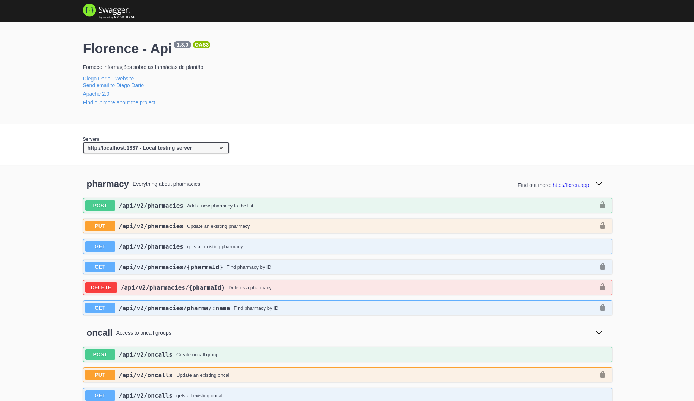

<!-- PROJECT LOGO -->
<br />
<p align="center">
  <a href="https://floren-api.appspot.com">
    
  </a>

  <h3 align="center">Floren API</h3>

  <p align="center">
    Um modelo de API RESTish moderadamente opinativo criado com Node.js
    <br />
    
  </p>
</p>

### About
Projetado para abstrair minimamente a lógica do banco de dados, esse modelo cria decisões comuns de design de API e permite distribuir rapidamente seus dados em formatos comuns, como JSON. 
Essa API alimenta o projeto FrontEnd FlorenApp, fornecendo as farmácias que estão de plantão através do endpoint /api/v2/oncalls/today. 

### Features
+ Versioning
+ Support for various data stores
+ Tests
+ Flexibility
+ Extensibility
+ The Javascript you know and love
+ Minimal abstractions

### Install
````
git clone https://github.com/diegodario88/ResidencialFlorenApi.git

cd ResidencialFlorenApi

npm install

````

### Start
````
npm start
````

The API runs on port ````1337```` by default, and the root can be accessed by navigating to ````http://localhost:1337 in your browser.

### Author
[Diego Dario](https://github.com/diegodario88).

### License
MIT.
